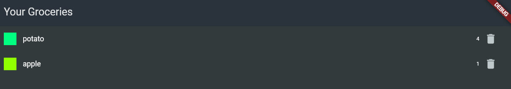

# Flutter Shopping List App with Firebase

Welcome to the Flutter Shopping List App repository! This project is a Flutter application that allows users to manage their shopping list. The app uses Firebase for backend services.

## Features

- Add new items to your shopping list.
- Delete items from the list.
- If the same item from the same category is added twice, its quantity is incremented instead of adding a duplicate.
- The app uses Firebase for data persistence, so your shopping list is always up-to-date across devices.

## Getting Started

This project is a starting point for a Flutter application. Here are a few resources to get you started if this is your first Flutter project:

- Lab: [Write your first Flutter app](https://flutter.dev/docs/get-started/codelab)
- Cookbook: [Useful Flutter samples](https://flutter.dev/docs/cookbook)

For help getting started with Flutter, view the [online documentation](https://flutter.dev/docs), which offers tutorials, samples, guidance on mobile development, and a full API reference.

## Installation

1. Clone the repository: `git clone https://github.com/TYPW1/shopping-list-app-flutter-U-.git`
2. Install Flutter: Follow the instructions [here](https://flutter.dev/docs/get-started/install).
3. Get the packages: Run `flutter pub get` in the project directory.
4. Run the app: `flutter run -d web-server`

## App Structure

This app is organized into several directories:

- `lib/`: This is where the Dart files live. This directory contains the main app file, as well as several subdirectories for different parts of the app (models, widgets, etc.).
- `lib/models/`: This directory contains the data models used in the app.
- `lib/widgets/`: This directory contains the various custom widgets used in the app.
- `lib/data/`: This directory contains the data used in the app.

## Technologies Used

- Flutter: An open-source UI software development kit by Google. 
- Firebase: A platform developed by Google for creating mobile and web applications.

## Contribution

Feel free to contribute to this project by opening issues and pull requests. Please follow the existing coding style, and make sure all tests pass before submitting a PR.

## License

This project is licensed under the MIT License. See the [LICENSE](/LICENSE) file for details.

## Contact

For any questions, please open an issue or contact `[{Cho}](https://github.com/cho237)https://github.com/cho237`.
